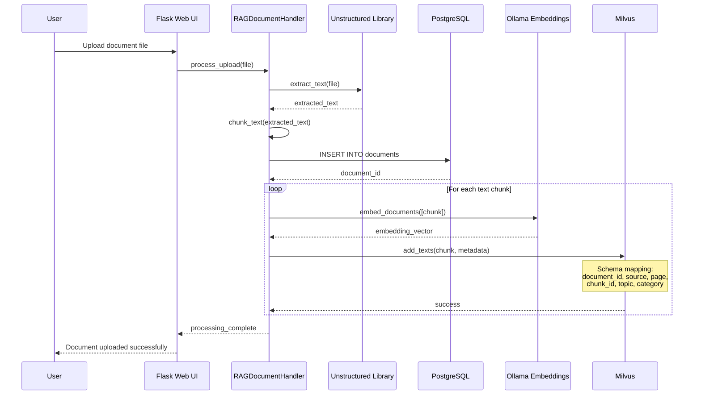
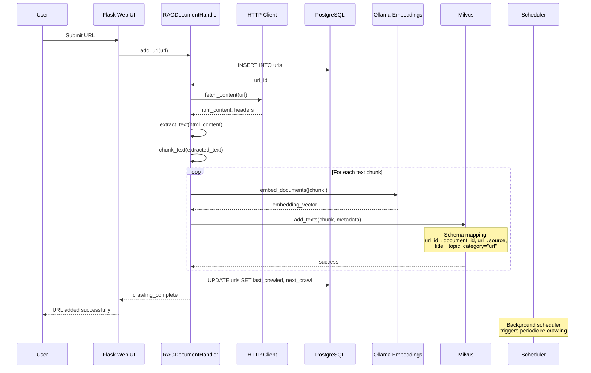
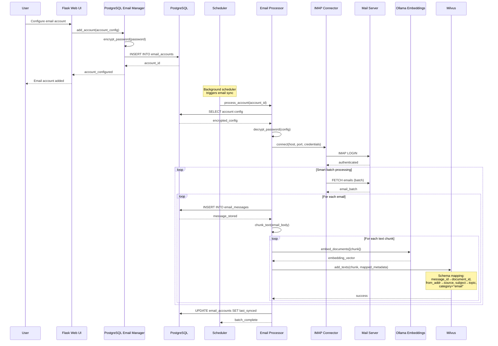
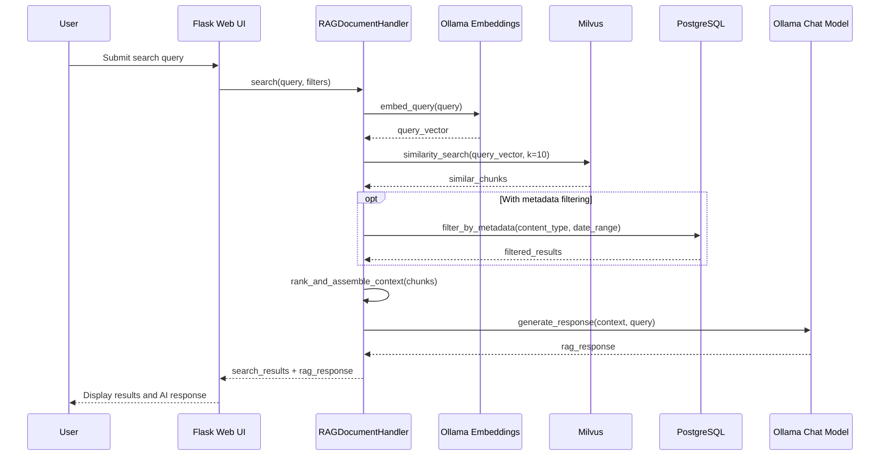
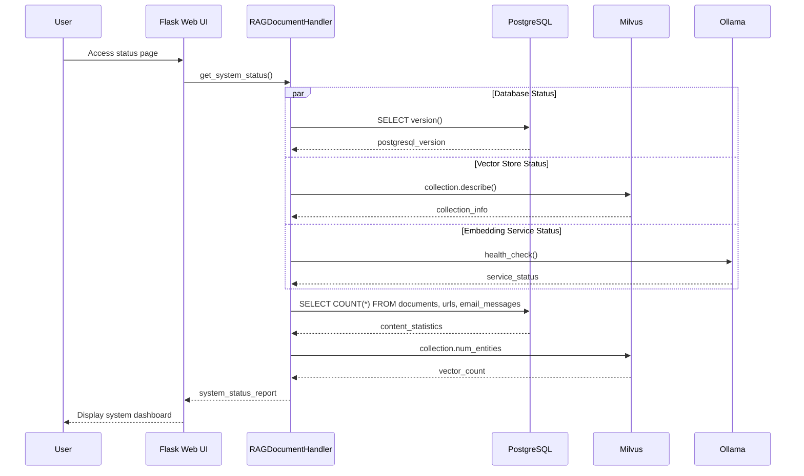

# System Architecture

The RAG Knowledgebase Manager uses a dual database architecture with Flask web application, PostgreSQL for metadata, and Milvus for vector embeddings. The codebase has been refactored to follow Python development best practices with proper module organization and separation of concerns.

## Enhanced RAG Pipeline with Email Classification

The system now features an advanced query classification pipeline that automatically determines whether user queries are about emails or general documents/URLs, enabling specialized handling for different content types.

### Query Classification Flow

1. **Query Analysis**: Each user query is first analyzed by a dedicated classification LLM
2. **Intent Detection**: The system classifies queries as either:
   - `email`: Questions about email content, senders, recipients, or email-specific metadata
   - `general`: Questions about documents, URLs, or general knowledge base content
3. **Specialized Search**: Based on classification, queries are routed to appropriate search pipelines:
   - Email queries → Email-specific vector search and formatting
   - General queries → Standard document/URL vector search
4. **Contextual Response**: Results are formatted with appropriate context and system prompts

### Email Classification Configuration

New environment variables support the classification system:

- `CLASSIFICATION_MODEL`: LLM model used for query intent classification (e.g., "llama3.2:3b")
- `OLLAMA_CLASSIFICATION_HOST`: Host for the classification Ollama service
- `OLLAMA_PORT`: Port for Ollama services

## Enhanced Email Processing Pipeline

The email processing system has been significantly enhanced with robust error handling, corruption detection, and real-time monitoring capabilities.

### Enhanced Architecture Components

#### Corruption Detection & Validation
- **Message-ID Validation**: All emails must have valid Message-ID headers (no fallback generation)
- **Header Validation**: Validates required headers (From, Date) before processing
- **Offset-Aware Logging**: Reports exact positions where corrupted emails are found
- **Fail-Fast Approach**: Stops processing corrupted emails without hidden fallbacks

#### Enhanced Error Handling
```python
def _parse_email_with_offset(self, msg_data, offset):
    """Enhanced email parsing with corruption detection and offset logging."""
    try:
        email_msg = email.message_from_bytes(msg_data)
        
        # Validate Message-ID (required, no fallback generation)
        message_id = email_msg.get('Message-ID')
        if not message_id:
            logger.error(f"Email at offset {offset} missing required Message-ID header")
            return None
            
        return email_msg
        
    except Exception as e:
        logger.error(f"Failed to parse email at offset {offset}: {str(e)}")
        return None
```

#### Real-Time Dashboard Monitoring
- **Auto-Refresh System**: All dashboard panels refresh every 10 seconds
- **Fresh Data API**: Edit modals fetch current database values via AJAX
- **Live Statistics**: Email counts and processing status updated in real-time
- **Error Visibility**: Processing errors immediately visible in dashboard
- **Offset Management**: Manual offset reset capability through web interface

### Enhanced UI Architecture

#### JavaScript Auto-Refresh System
```javascript
function initializeAutoRefresh() {
    // Auto-refresh all dashboard panels every 10 seconds
    setInterval(() => {
        refreshEmailAccounts();
        refreshURLMonitoring();
        refreshDocuments();
        refreshRAGQueries();
    }, 10000);
}
```

#### AJAX Fresh Data Fetching
- **Fresh Email Account Data**: Edit modals fetch current values from `/email_accounts` API
- **Event Listener Management**: Proper reattachment after DOM updates
- **Error Handling**: Graceful fallback when AJAX requests fail
- **Real-Time Updates**: Immediate reflection of database changes in UI

## Code Structure

The application has been reorganized into logical modules following Python best practices with enhanced template organization:

```
rag_manager/
├── __init__.py                    # Package initialization
├── app.py                         # Main application orchestrator
├── core/
│   ├── __init__.py
│   ├── config.py                  # Centralized configuration management
│   └── models.py                  # Data models and dataclasses
├── managers/
│   ├── __init__.py
│   ├── milvus_manager.py          # Vector database operations
│   └── postgres_manager.py       # PostgreSQL operations
├── web/
│   ├── __init__.py
│   ├── routes.py                  # Flask routes and web endpoints
│   ├── stats.py                   # Statistics coordinator
│   └── panels/                    # Panel-specific statistics providers
│       ├── __init__.py
│       ├── email_panel.py         # Email panel statistics
│       ├── url_panel.py           # URL panel statistics
│       ├── knowledgebase_panel.py # Document panel statistics
│       └── system_panel.py        # System panel statistics
└── scheduler_manager.py           # Background task scheduling

templates/
├── index.html                     # Main dashboard (now uses partials)
├── search.html                    # Search interface
└── partials/                      # Modular template components
    ├── _head.html                 # Document head and meta tags
    ├── _navbar.html               # Main navigation bar
    ├── _flash_messages.html       # Flash message display
    ├── _stats_panel.html          # Statistics dashboard panel
    ├── _file_upload.html          # File upload section
    ├── _staging_area.html         # Staging area for processing
    ├── _url_management.html       # URL management interface
    ├── _url_edit_modals.html      # URL edit modal dialogs
    ├── _email_accounts.html       # Email accounts management
    ├── _email_modals.html         # Email account modal dialogs
    ├── _processed_documents.html  # Processed documents display
    ├── _document_edit_modals.html # Document edit modal dialogs
    └── _scripts.html              # JavaScript and external scripts

ingestion/
├── core/                          # Database abstraction and PostgreSQL management
├── email/                         # Email processing with multiple connector support
├── url/                           # URL crawling and content processing
├── document/                      # Document extraction and chunking
└── utils/                         # Shared utilities (crypto, scheduling)
```

## Enhanced Statistics Architecture

The application now features a panel-specific statistics architecture that provides better organization and maintainability:

### Statistics Coordinator (`web/stats.py`)
The main `StatsProvider` class acts as a coordinator that delegates to individual panel providers:
- Lightweight coordination layer
- Clean imports from panels package  
- Simple delegation methods for each panel type
- Consistent error handling across all panels

### Individual Panel Statistics Providers

**Email Panel Statistics (`web/panels/email_panel.py`):**
- Email account metrics and sync status
- Attachment counts and processing statistics
- Most active account identification
- Due-for-sync calculations with proper interval handling

**URL Panel Statistics (`web/panels/url_panel.py`):**
- URL scraping counts and status tracking
- Due date calculations with refresh intervals
- Robots.txt compliance and crawl settings
- Snapshot management statistics

**Knowledgebase Panel Statistics (`web/panels/knowledgebase_panel.py`):**
- Document collection statistics from Milvus and PostgreSQL
- Metadata analytics and keyword extraction
- Collection health and indexing status
- Cross-database data consistency checks

**System Panel Statistics (`web/panels/system_panel.py`):**
- Database connection status monitoring
- Milvus cluster health checks
- Processing queue monitoring
- System resource and connectivity validation

### Partials Structure

**Core Layout Partials:**
- `_head.html`: Document metadata, stylesheets, and external resources
- `_navbar.html`: Main navigation bar with responsive design
- `_scripts.html`: JavaScript libraries and application scripts

**Content Partials:**
- `_flash_messages.html`: Flash message display system
- `_stats_panel.html`: Comprehensive statistics dashboard
- `_file_upload.html`: Document upload interface
- `_staging_area.html`: File processing staging area
- `_processed_documents.html`: Processed documents management

**Feature-Specific Partials:**
- `_url_management.html`: URL management interface with table display
- `_url_edit_modals.html`: URL editing modal dialogs
- `_email_accounts.html`: Email account management interface  
- `_email_modals.html`: Email account modal dialogs (add, edit, delete)
- `_document_edit_modals.html`: Document metadata editing modals

### Template Organization Benefits

1. **Maintainability**: Each section is self-contained and easy to modify
2. **Reusability**: Partials can be included across multiple pages
3. **Team Development**: Multiple developers can work on different UI sections simultaneously
4. **Debugging**: Issues can be isolated to specific template partials
5. **Performance**: Easier to optimize specific sections without affecting others
6. **Consistency**: Shared components ensure consistent UI patterns

### Main Template Structure

The main `index.html` follows a clean, declarative structure:

```html
<!DOCTYPE html>
<html lang="en">

<body class="bg-light">
    
    
    <div class="container mt-4">
        
        
        
        
        
        
        
        
        
        
    </div>
    
    
</body>
</html>
```
│   ├── __init__.py
│   └── milvus_manager.py          # Milvus database operations and RAG search
└── web/
    ├── __init__.py
    └── routes.py                  # Flask routes and web handlers

retrieval/
├── __init__.py                    # Retrieval system initialization
├── email/
│   ├── __init__.py
│   ├── hybrid_retriever.py        # Email hybrid search with RRF fusion
│   └── postgres_fts_retriever.py  # PostgreSQL full-text search for emails
└── document/
    ├── __init__.py
    └── (future document retrieval components)

ingestion/
├── __init__.py                    # Ingestion package initialization
├── core/
│   ├── __init__.py
│   ├── database_manager.py        # Core database abstraction layer
│   ├── postgres_manager.py        # PostgreSQL connection and operations
│   └── db_utils.py                # Database utility functions
├── email/
│   ├── __init__.py
│   ├── manager.py                 # PostgreSQL-based email account management
│   ├── email_manager_postgresql.py # Email message storage and retrieval
│   ├── processor.py               # Email content processing and embedding
│   ├── orchestrator.py            # Email processing coordination
│   └── connectors/                # Email protocol implementations
│       ├── __init__.py
│       ├── imap_connector.py      # IMAP protocol handler
│       ├── gmail_connector.py     # Gmail API integration
│       └── exchange_connector.py  # Exchange server integration
├── url/
│   ├── __init__.py
│   ├── manager.py                 # URL metadata and scheduling management
│   └── orchestrator.py            # URL processing and document integration
├── document/
│   ├── __init__.py
│   └── processor.py               # Document content extraction and chunking
└── utils/
    ├── __init__.py
    ├── crypto.py                  # Encryption utilities for sensitive data
    └── scheduler_utils.py          # Scheduling and timing utilities
```

### Key Architectural Improvements

1. **Separation of Concerns**: Each module has a single responsibility
2. **Consistent Structure**: All ingestion types (email, URL, document) follow the same pattern
3. **Dependency Injection**: Components are properly injected rather than tightly coupled
4. **Type Safety**: All modules use proper type hints and annotations
5. **Error Handling**: Comprehensive exception handling with specific error types
6. **Comprehensive Logging**: Detailed logging throughout all components following DEVELOPMENT_RULES.md
7. **Configuration Management**: Centralized configuration with environment variable support
8. **Crypto Separation**: Sensitive data encryption isolated in dedicated crypto module

## Components

| Component | Description |
|-----------|-------------|
| `app.py` | Main Flask application entry point |
| `rag_manager/app.py` | Main application orchestrator class |
| `rag_manager/managers/milvus_manager.py` | Vector database operations and RAG search functionality |
| `rag_manager/web/routes.py` | Web interface and route handlers |
| `retrieval/email/hybrid_retriever.py` | Email hybrid search combining vector + PostgreSQL FTS with RRF fusion |
| `retrieval/email/postgres_fts_retriever.py` | PostgreSQL full-text search optimized for email content |
| `ingestion/core/` | Core database abstraction and PostgreSQL management |
| `ingestion/email/` | Email account management, processing, and connectors |
| `ingestion/url/` | URL crawling, scheduling, and content processing |
| `ingestion/document/` | Document content extraction and chunking |
| `ingestion/utils/` | Shared utilities including encryption and scheduling |
| `templates/` | Jinja2 templates for the responsive web UI |
| `static/` | Static assets (CSS, JS, images) used by the templates |
| `start.sh` | Application startup script with service checks |
| `uninstall.sh` | Safe removal script with `--dry-run` and project-specific cleanup |
| `docker-compose.yml` | Container orchestration for PostgreSQL and Milvus |

## Database Architecture

### PostgreSQL (Metadata Storage)

#### Documents Table
- **document_id** (VARCHAR): Unique identifier for uploaded documents
- **filename** (VARCHAR): Original filename from upload
- **content_type** (VARCHAR): MIME type of the document
- **file_size** (INTEGER): Size in bytes
- **upload_timestamp** (TIMESTAMP): When document was uploaded
- **processing_status** (VARCHAR): Processing state (pending, completed, failed)
- **metadata** (JSONB): Flexible attributes (page_count, author, etc.)

#### URLs Table  
- **id** (UUID, PRIMARY KEY): Auto-generated unique identifier
- **url** (VARCHAR): The crawled URL
- **title** (VARCHAR): Extracted page title
- **status** (VARCHAR): Crawl status (active, inactive, failed)
- **last_crawled** (TIMESTAMP): Last successful crawl time
- **next_crawl** (TIMESTAMP): Scheduled next crawl time
- **crawl_interval_minutes** (INTEGER): Refresh frequency
- **metadata** (JSONB): Page metadata, headers, content stats

#### Email Accounts Table
- **id** (SERIAL, PRIMARY KEY): Auto-incrementing account ID
- **account_name** (VARCHAR): User-friendly name for the account
- **server_type** (VARCHAR): Protocol type (imap, pop3, exchange)
- **server** (VARCHAR): Mail server hostname
- **port** (INTEGER): Mail server port number
- **email_address** (VARCHAR): Account email address
- **encrypted_password** (BYTEA): Encrypted password using EMAIL_ENCRYPTION_KEY
- **mailbox** (VARCHAR): Target mailbox/folder (default: INBOX)
- **batch_limit** (INTEGER): Maximum emails per batch
- **use_ssl** (BOOLEAN): Enable SSL/TLS connection
- **refresh_interval_minutes** (INTEGER): Sync frequency
- **offset_position** (INTEGER): **NEW**: Current processing offset position for resuming operations
- **last_synced** (TIMESTAMP): Last successful sync time
- **last_update_status** (VARCHAR): Status of last sync attempt
- **next_run** (TIMESTAMP): Scheduled next sync time

#### Email Messages Table
- **message_id** (VARCHAR, PRIMARY KEY): **REQUIRED**: Unique email message identifier (no fallback generation)
- **account_id** (INTEGER, FOREIGN KEY): References email_accounts.id
- **subject** (VARCHAR): Email subject line
- **from_addr** (VARCHAR): Sender email address
- **to_addrs** (TEXT): Comma-separated recipient addresses
- **date_utc** (TIMESTAMP): Email date in UTC
- **body_text** (TEXT): Plain text body content
- **body_html** (TEXT): HTML body content
- **attachments_info** (JSONB): Attachment metadata
- **server_type** (VARCHAR): Source server type
- **content_hash** (VARCHAR): **NEW**: Hash for deduplication across accounts
- **validation_status** (VARCHAR): **NEW**: Corruption detection results ('valid', 'corrupted', 'missing_headers')
- **processed_timestamp** (TIMESTAMP): When email was processed

### Milvus (Vector Storage)

#### Documents Collection Schema
The Milvus collection uses a unified schema for all content types (documents, URLs, emails):

- **document_id** (VARCHAR, max_length=65535): Source document identifier
- **source** (VARCHAR, max_length=65535): Content source (file path, URL, email address)
- **page** (INT64): Page number for documents, chunk index for other content
- **chunk_id** (VARCHAR, max_length=65535): Unique identifier for text chunk
- **topic** (VARCHAR, max_length=65535): Subject, title, or main topic
- **category** (VARCHAR, max_length=65535): Content type (document, url, email)
- **content_hash** (VARCHAR, max_length=65535): Hash for deduplication
- **content_length** (INT64): Character count of the text chunk
- **text** (VARCHAR, max_length=65535): The actual text content for search
- **pk** (INT64, auto_id=True): Auto-generated primary key
- **vector** (FLOAT_VECTOR, dim=384): Embedding vector from mxbai-embed-large model

## Data Flow

### Document Upload Flow
1. **File Upload**: Users upload documents through web interface
2. **Content Extraction**: Text extracted using DocumentProcessor with unstructured library
3. **Text Chunking**: Content split into overlapping chunks optimized for embedding
4. **PostgreSQL Storage**: Document metadata stored in documents table via RAGDatabaseManager
5. **Vector Generation**: Text chunks embedded using Ollama (mxbai-embed-large model)
6. **Milvus Storage**: Embeddings stored through MilvusManager with mapped metadata fields

### URL Crawling Flow
1. **URL Submission**: Users submit URLs through web interface
2. **URL Management**: URLs stored and scheduled via ingestion/url/manager.py
3. **Content Crawling**: URLOrchestrator coordinates web page fetching and parsing
4. **Document Processing**: Content processed through ingestion/document/processor.py
5. **PostgreSQL Storage**: URL metadata stored in urls table with scheduling information
6. **Vector Storage**: Page content embedded and stored in Milvus with url category

### Email Processing Flow
1. **Account Configuration**: Email accounts encrypted and stored via ingestion/email/manager.py
2. **Connector Selection**: Appropriate connector (IMAP, Gmail, Exchange) instantiated
3. **Smart Batch Processing**: EmailProcessor coordinates batched email retrieval
4. **Content Processing**: Email content extracted and chunked for optimal embedding
5. **Dual Storage**: 
   - **PostgreSQL**: Email metadata via email_manager_postgresql.py
   - **Milvus**: Text embeddings through dedicated email vector store
6. **Orchestrated Sync**: EmailOrchestrator manages periodic synchronization

### Hybrid Retrieval System

The system implements a sophisticated search engine that finds the most relevant email content by combining two different search approaches and intelligently merging their results.

#### What Does It Actually Do?

**The Problem**: When you search for emails, you want to find content that matches both:
1. **Exact keywords** you're looking for (like "budget meeting" or "project deadline")
2. **Conceptual meaning** even if different words are used (like finding "financial planning" when you search for "budget")

**The Solution**: Two specialized search engines working together:

#### 1. PostgreSQL Full-Text Search (PostgresFTSRetriever)
**What it does**: Finds emails containing your exact keywords and related word forms
**How it works**:
- Searches through all email text stored in PostgreSQL database
- Uses PostgreSQL's built-in text search with stemming (finds "running" when you search "run")
- Ranks results by how well they match your keywords using `ts_rank` scoring
- Fast because it uses pre-built GIN indexes on the text

**Example**: If you search "quarterly report", it finds emails containing:
- "quarterly report" (exact match)
- "quarterly reports" (plural form) 
- "quarter report" (stemmed form)
- Ranks emails with multiple keyword matches higher

#### 2. Vector Similarity Search (via Milvus)
**What it does**: Finds emails that are conceptually similar to your search, even with different words
**How it works**:
- Email content is converted to mathematical vectors (embeddings) that capture meaning
- Your search query is also converted to a vector
- Finds emails whose vectors are "close" to your query vector in mathematical space
- Good at finding synonyms, related concepts, and contextual matches

**Example**: If you search "budget planning", it finds emails about:
- "financial forecasting" 
- "cost analysis"
- "expense management"
- "resource allocation"
(Even though none contain the exact words "budget planning")

#### 3. Hybrid Fusion (HybridRetriever)
**What it does**: Combines both search methods to get the best results
**How it works using Reciprocal Rank Fusion (RRF)**:

```
Step 1: Run both searches in parallel
- PostgreSQL FTS finds keyword matches
- Vector search finds conceptual matches

Step 2: Rank each result list
- PostgreSQL results: #1, #2, #3... (by keyword relevance)
- Vector results: #1, #2, #3... (by conceptual similarity)

Step 3: Apply RRF scoring formula
For each document: RRF_score = 1 / (rank + 60)
- Document ranked #1 gets score: 1/61 = 0.016
- Document ranked #2 gets score: 1/62 = 0.016
- If same document appears in both lists, scores are added

Step 4: Re-rank by combined scores
Documents that appear in both searches get highest scores
```

**Real Example**:
Search: "project timeline delay"

PostgreSQL FTS finds:
1. Email: "Project timeline needs adjustment" (score: 0.016)
2. Email: "Timeline delay notification" (score: 0.016) 
3. Email: "Project schedule update" (score: 0.015)

Vector Search finds:
1. Email: "Schedule postponement discussion" (score: 0.016)
2. Email: "Timeline delay notification" (score: 0.016)  
3. Email: "Deadline extension request" (score: 0.015)

Final Hybrid Results:
1. "Timeline delay notification" (combined score: 0.032) ← Found by both!
2. "Project timeline needs adjustment" (score: 0.016)
3. "Schedule postponement discussion" (score: 0.016)
4. "Project schedule update" (score: 0.015)

#### Component Details

**retrieval/email/postgres_fts_retriever.py**
- **Purpose**: Keyword-based email search using PostgreSQL's text search engine
- **Input**: Search query string (e.g., "budget meeting tomorrow")
- **Process**: 
  - Converts query to `plainto_tsquery` for PostgreSQL
  - Searches `email_chunks` table using `@@` text search operator
  - Ranks by `ts_rank` relevance scoring
- **Output**: LangChain `Document` objects with email content and metadata
- **Strengths**: Fast exact keyword matching, handles stemming and stop words
- **Use Case**: When you know specific words/phrases that should be in the email

**retrieval/email/hybrid_retriever.py**
- **Purpose**: Combines keyword and semantic search for comprehensive results
- **Input**: Search query + number of results needed
- **Process**:
  - Calls PostgreSQL FTS retriever for keyword matches
  - Calls Milvus vector retriever for semantic matches  
  - Applies RRF formula to merge and re-rank results
  - Handles deduplication when same email found by both methods
- **Output**: Unified ranked list of most relevant emails
- **Strengths**: Gets both exact matches AND related concepts
- **Use Case**: Most email searches where you want comprehensive, intelligent results

**Integration in Email Manager**
```python
# How it's used in ingestion/email/manager.py
def search_emails_hybrid(self, query: str, top_k: int = 5):
    # This method uses the hybrid retriever to search emails
    return self.hybrid_retriever.search(query, k=top_k)
```

**Advanced Implementation Archive**
- **Location**: `backup/unused_retrievers/processors_advanced_implementation/`
- **Why Archived**: Had more features but wasn't compatible with LangChain
- **Features**: Custom result classes, more sophisticated query preprocessing
- **Decision**: Kept simpler version that works with existing RAG pipeline

#### How Email Search Actually Works (Step-by-Step)

1. **User Searches**: Types query like "budget meeting next week" in the web interface

2. **Email Manager Receives Query**: `ingestion/email/manager.py` calls `search_emails_hybrid()`

3. **Hybrid Retriever Executes Two Searches in Parallel**:
   - **PostgreSQL FTS**: Looks for emails containing "budget", "meeting", "next", "week"
   - **Vector Search**: Finds emails conceptually similar (financial planning, scheduled meetings, etc.)

4. **Both Return Ranked Lists**:
   - FTS: 10 emails ranked by keyword match strength
   - Vector: 10 emails ranked by semantic similarity

5. **RRF Fusion Combines Results**:
   - Calculates combined score for each email
   - Emails found by both methods get highest scores
   - Creates final unified ranking

6. **Results Returned to Web Interface**: Top 5-10 most relevant emails with content and metadata

7. **RAG Context Assembly**: Selected email content provides context for LLM to generate intelligent responses

#### Why This Approach Works Better

**Traditional Keyword Search Problems**:
- Miss relevant emails that use different terminology
- Can't understand context or relationships between concepts
- Often return too many irrelevant results with common keywords

**Vector Search Problems**:
- Sometimes miss obvious exact keyword matches
- Can be "too smart" and return conceptually related but not directly relevant content
- Harder to debug why certain results were chosen

**Hybrid Solution Benefits**:
- **Precision**: Gets exact keyword matches when they exist
- **Recall**: Finds related content even with different wording  
- **Relevance**: Documents found by both methods are usually most relevant
- **Fallback**: If one method fails, the other still works
- **Explainable**: Can see why each result was chosen (keywords vs. concepts)

### Search and Retrieval Flow
1. **Query Processing**: User search queries processed through web interface
2. **Vector Search**: Query embedded and compared against Milvus vectors
3. **Metadata Filtering**: PostgreSQL queries filter by content type, date, source
4. **Result Ranking**: Combined similarity scores and metadata relevance
5. **Context Assembly**: Retrieved chunks assembled for RAG generation
6. **LLM Integration**: Context provided to Ollama for intelligent responses

## Sequence Diagrams

### Document Upload Flow



### URL Crawling Flow



### URL Snapshots (Point-in-time capture)

To ensure search results reference the exact version of a web page used for embeddings, the system supports point-in-time snapshots for URLs:

- Two artifacts are captured per successful crawl:
    - PDF: human-friendly rendering of the page at time of crawl
    - MHTML: single-file archive preserving assets for high-fidelity replay
- Files are stored locally (configurable base dir via `SNAPSHOT_DIR`, default `uploaded/snapshots`), and each capture is linked to its URL via a `url_snapshots` record.
- For URL embeddings, the Milvus `document_id` is set to the snapshot id, guaranteeing that retrieved chunks can be traced to a specific snapshot.

Storage layout (example):
- `uploaded/snapshots/{url_id}/{UTC_ISO8601}/page.pdf`
- `uploaded/snapshots/{url_id}/{UTC_ISO8601}/page.mhtml`
- `uploaded/snapshots/{url_id}/{UTC_ISO8601}/metadata.json`

Milvus mapping for URL snapshots:
- `document_id` = snapshot_id (UUID)
- `source` = original URL
- `topic` = extracted page title
- `category` = "url"
- `chunk_id` = `{snapshot_id}:{chunk_index}`

Operational notes:
- Snapshots are optional and controlled per-URL via `urls.snapshot_enabled` (default for new URLs comes from `SNAPSHOT_DEFAULT_ENABLED`).
- Retention can be enforced (max snapshots per URL or days to keep).
- Files are served read-only; database stores metadata and linkages.

### Email Processing Flow



### Search and RAG Flow



### System Health and Status Flow



## Schema Mapping and Data Integration

### Email-to-Milvus Schema Mapping
Email content is mapped to the unified Milvus document schema as follows:

| Email Field | Milvus Field | Mapping Logic |
|-------------|--------------|---------------|
| `message_id` | `document_id` | Direct mapping for unique identification |
| `from_addr` | `source` | Prefixed as `email:{from_addr}` |
| `subject` | `topic` | Email subject becomes the topic |
| `chunk_index` | `page` | Text chunk number |
| `message_id:chunk_id` | `chunk_id` | Composite chunk identifier |
| `"email"` | `category` | Fixed category for all email content |
| `generated_hash` | `content_hash` | Format: `email_{message_id}_{chunk_idx}` |
| `chunk_length` | `content_length` | Character count of text chunk |
| `body_text_chunk` | `text` | Actual searchable text content |

### PostgreSQL-Milvus Consistency
- **Dual Write Pattern**: Email metadata stored in PostgreSQL, embeddings in Milvus
- **Referential Integrity**: `message_id` links PostgreSQL records to Milvus vectors
- **Deduplication**: Milvus `content_hash` prevents duplicate embeddings
- **Backup Strategy**: PostgreSQL serves as source of truth for metadata recovery

## Configuration Management

### Environment Variables
- **`EMAIL_ENCRYPTION_KEY`**: Fernet key for encrypting stored email passwords
- **`MILVUS_HOST/PORT`**: Vector database connection settings
- **`POSTGRES_HOST/PORT/DB/USER/PASSWORD`**: Relational database connection
- **`COLLECTION_NAME`**: Milvus collection name (default: "documents")
- **`VECTOR_DIM`**: Embedding dimension (384 for mxbai-embed-large)

## Development Architecture

### Development Mode (`./setup.sh --dev`)
```
┌─────────────────┐    ┌─────────────────┐
│   PostgreSQL    │    │     Milvus      │
│   Container     │    │   Container     │
│  (localhost:    │    │ (localhost:     │
│     5432)       │    │    19530)       │
└─────────────────┘    └─────────────────┘
         │                       │
         └───────┬───────────────┘
                 │
         ┌─────────────────┐
         │  Flask App      │
         │  (Local Dev)    │
         │ (localhost:3000)│
         └─────────────────┘
```

### Production Mode (`./setup.sh --all`)
```
┌─────────────────┐    ┌─────────────────┐    ┌─────────────────┐
│   PostgreSQL    │    │     Milvus      │    │     WebUI       │
│   Container     │    │   Container     │    │   Container     │
└─────────────────┘    └─────────────────┘    └─────────────────┘
```

## Management Scripts

### Setup Script (`./setup.sh`)
- **`--all`**: Automated installation without prompts
- **`--dev`**: Development mode (infrastructure only, run app locally)  
- **`--help`**: Display installation options and usage

### Uninstall Script (`./uninstall.sh`)
- **`--dry-run`**: Preview removal without making changes
- **`--help`**: Display removal options
- **Project-safe**: Only removes RAG-specific containers and files

### Status Script (`./status.sh`)
- Environment validation
- Container health checks
- Database connectivity testing
- Directory structure verification

## Security Considerations

### Email Account Security
- **Password Encryption**: Email passwords encrypted using Fernet with `EMAIL_ENCRYPTION_KEY`
- **Key Rotation**: Environment variable allows for key updates and re-encryption
- **Connection Security**: IMAP/POP3 connections use SSL/TLS with certificate validation
- **Credential Isolation**: Email credentials stored separately from application credentials

### Database Security
- **Connection Encryption**: PostgreSQL connections use TLS in production
- **User Isolation**: Dedicated `rag_user` with limited database permissions
- **Environment Variables**: Sensitive data stored in `.env` file, excluded from version control
- **Container Security**: Database containers run with non-root users where possible

### Vector Database Security
- **Network Isolation**: Milvus accessible only through Docker networks in production
- **Access Control**: Future implementation of Milvus authentication and authorization
- **Data Validation**: Schema validation prevents malformed vector insertions

### Application Security
- **Flask Secret Key**: Used for session security and CSRF protection
- **File Upload Validation**: Content type and size restrictions on uploads
- **Path Sanitization**: Upload paths sanitized to prevent directory traversal
- **Error Handling**: Sensitive information not exposed in error messages

## Scalability Notes

- **Horizontal Scaling**: Milvus supports clustering for large datasets
- **Database Optimization**: PostgreSQL JSONB indexes for metadata queries
- **Embedding Models**: Ollama provides local inference without API dependencies
- **Caching**: Future implementation of Redis for session and query caching

## Future Enhancements

### Performance and Scaling
- [ ] Add Milvus clustering support for large datasets
- [ ] Optimize PostgreSQL queries with proper indexing
- [ ] Add connection pooling for database connections

### Monitoring and Observability
- [ ] Add structured logging with correlation IDs
- [ ] Create alerting for failed email syncs and vector insertions

### Documentation Improvements
- [ ] Add sequence diagrams describing data flow
- [ ] Document troubleshooting procedures for common issues
- [ ] Add schema migration documentation

### Security Enhancements
- [ ] Add Milvus authentication and authorization
- [ ] Implement audit logging for sensitive operations
- [ ] Add role-based access control for web interface
- [ ] Rotate encryption keys automatically

### Feature Additions
- [ ] Support for additional email providers (Exchange, Office365)
- [ ] Document versioning and change tracking
- [ ] Advanced search filters and faceted search
- [ ] Email attachment processing and indexing
- [ ] Automated content classification and tagging
