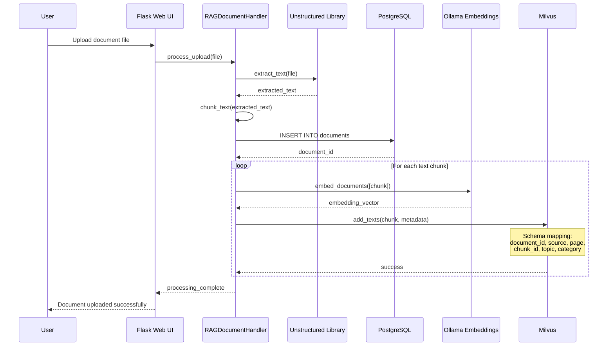
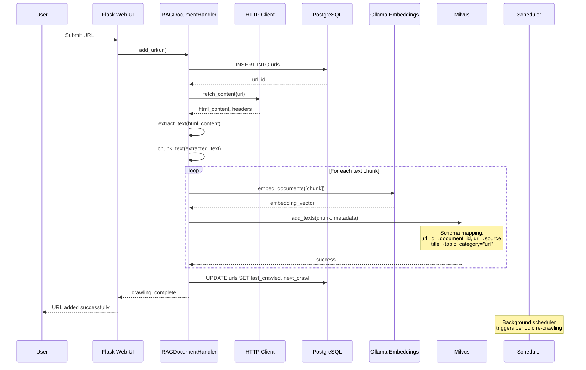
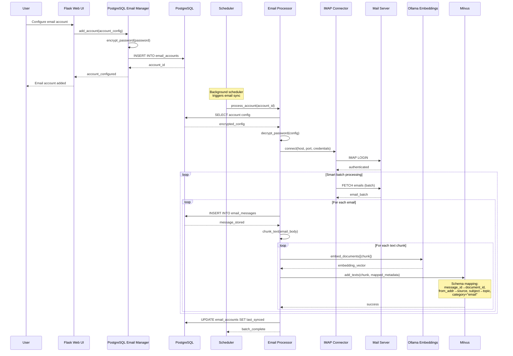
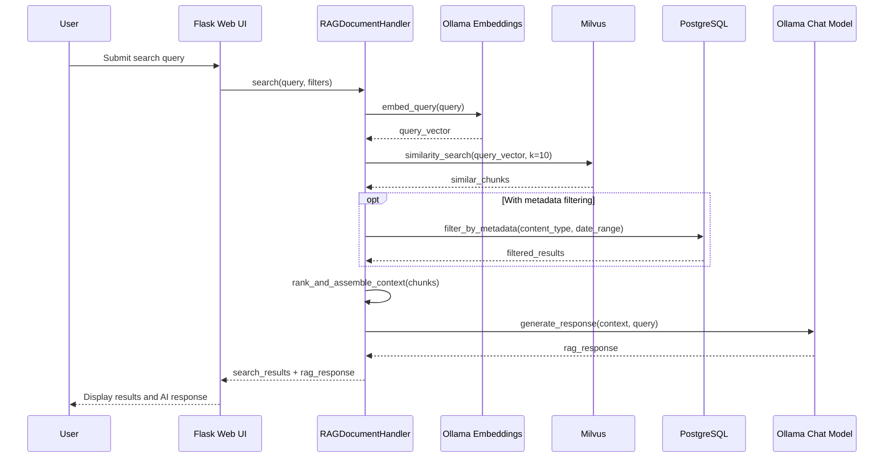
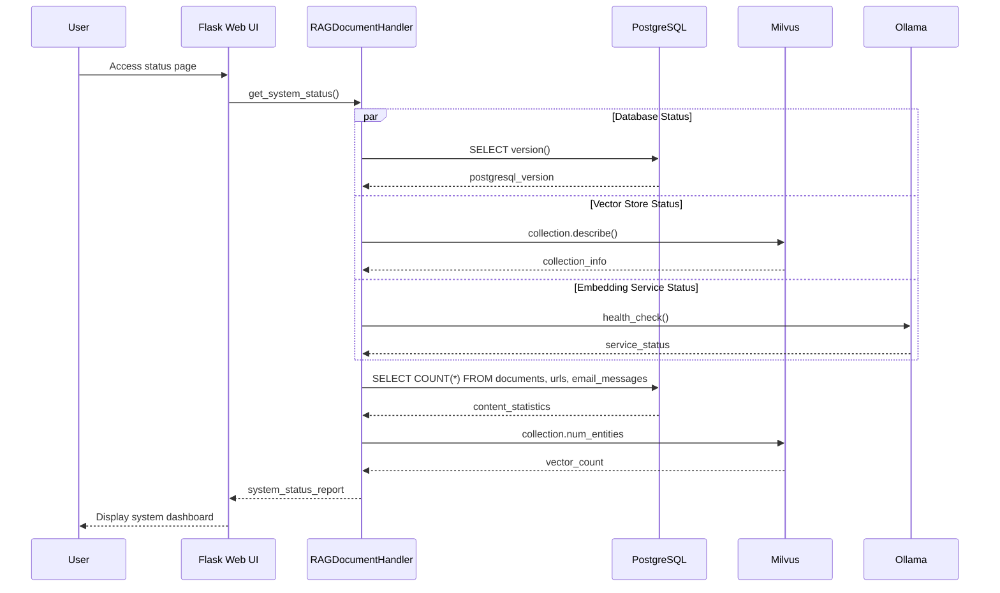

# System Architecture

The RAG Document Handler uses a dual database architecture with Flask web application, PostgreSQL for metadata, and Milvus for vector embeddings.

## Components

| Component | Description |
|-----------|-------------|
| `app.py` | Main Flask application with `RAGDocumentHandler` class implementing upload, URL management, embedding generation, and search |
| `ingestion/` | Database management modules for PostgreSQL and Milvus integration |
| `templates/` | Jinja2 templates for the responsive web UI |
| `static/` | Static assets (CSS, JS, images) used by the templates |
| `setup.sh` | Enhanced setup script with `--all`, `--dev`, and `--help` flags |
| `uninstall.sh` | Safe removal script with `--dry-run` and project-specific cleanup |
| `docker-compose.yml` | Container orchestration for PostgreSQL and Milvus |

## Database Architecture

### PostgreSQL (Metadata Storage)

#### Documents Table
- **document_id** (VARCHAR): Unique identifier for uploaded documents
- **filename** (VARCHAR): Original filename from upload
- **content_type** (VARCHAR): MIME type of the document
- **file_size** (INTEGER): Size in bytes
- **upload_timestamp** (TIMESTAMP): When document was uploaded
- **processing_status** (VARCHAR): Processing state (pending, completed, failed)
- **metadata** (JSONB): Flexible attributes (page_count, author, etc.)

#### URLs Table  
- **id** (UUID, PRIMARY KEY): Auto-generated unique identifier
- **url** (VARCHAR): The crawled URL
- **title** (VARCHAR): Extracted page title
- **status** (VARCHAR): Crawl status (active, inactive, failed)
- **last_crawled** (TIMESTAMP): Last successful crawl time
- **next_crawl** (TIMESTAMP): Scheduled next crawl time
- **crawl_interval_minutes** (INTEGER): Refresh frequency
- **metadata** (JSONB): Page metadata, headers, content stats

#### Email Accounts Table
- **id** (SERIAL, PRIMARY KEY): Auto-incrementing account ID
- **account_name** (VARCHAR): User-friendly name for the account
- **server_type** (VARCHAR): Protocol type (imap, pop3, exchange)
- **server** (VARCHAR): Mail server hostname
- **port** (INTEGER): Mail server port number
- **email_address** (VARCHAR): Account email address
- **encrypted_password** (BYTEA): Encrypted password using EMAIL_ENCRYPTION_KEY
- **mailbox** (VARCHAR): Target mailbox/folder (default: INBOX)
- **batch_limit** (INTEGER): Maximum emails per batch
- **use_ssl** (BOOLEAN): Enable SSL/TLS connection
- **refresh_interval_minutes** (INTEGER): Sync frequency
- **last_synced** (TIMESTAMP): Last successful sync time
- **last_update_status** (VARCHAR): Status of last sync attempt
- **next_run** (TIMESTAMP): Scheduled next sync time

#### Email Messages Table
- **message_id** (VARCHAR, PRIMARY KEY): Unique email message identifier
- **account_id** (INTEGER, FOREIGN KEY): References email_accounts.id
- **subject** (VARCHAR): Email subject line
- **from_addr** (VARCHAR): Sender email address
- **to_addrs** (TEXT): Comma-separated recipient addresses
- **date_utc** (TIMESTAMP): Email date in UTC
- **body_text** (TEXT): Plain text body content
- **body_html** (TEXT): HTML body content
- **attachments_info** (JSONB): Attachment metadata
- **server_type** (VARCHAR): Source server type
- **processed_timestamp** (TIMESTAMP): When email was processed

### Milvus (Vector Storage)

#### Documents Collection Schema
The Milvus collection uses a unified schema for all content types (documents, URLs, emails):

- **document_id** (VARCHAR, max_length=65535): Source document identifier
- **source** (VARCHAR, max_length=65535): Content source (file path, URL, email address)
- **page** (INT64): Page number for documents, chunk index for other content
- **chunk_id** (VARCHAR, max_length=65535): Unique identifier for text chunk
- **topic** (VARCHAR, max_length=65535): Subject, title, or main topic
- **category** (VARCHAR, max_length=65535): Content type (document, url, email)
- **content_hash** (VARCHAR, max_length=65535): Hash for deduplication
- **content_length** (INT64): Character count of the text chunk
- **text** (VARCHAR, max_length=65535): The actual text content for search
- **pk** (INT64, auto_id=True): Auto-generated primary key
- **vector** (FLOAT_VECTOR, dim=384): Embedding vector from mxbai-embed-large model

## Data Flow

### Document Upload Flow
1. **File Upload**: Users upload documents through web interface
2. **Content Extraction**: Text extracted using unstructured library
3. **Text Chunking**: Content split into overlapping chunks for embedding
4. **PostgreSQL Storage**: Document metadata stored in documents table
5. **Vector Generation**: Text chunks embedded using Ollama (mxbai-embed-large)
6. **Milvus Storage**: Embeddings stored with mapped metadata fields

### URL Crawling Flow
1. **URL Submission**: Users submit URLs through web interface
2. **Content Crawling**: Web pages fetched and parsed for text content
3. **Metadata Extraction**: Title, headers, and page info extracted
4. **PostgreSQL Storage**: URL metadata stored in urls table with JSONB attributes
5. **Text Processing**: Page content chunked for optimal embedding
6. **Vector Storage**: Embeddings stored in Milvus with url category

### Email Processing Flow
1. **Account Configuration**: Email accounts stored encrypted in email_accounts table
2. **IMAP/POP3 Connection**: Connector establishes secure connection to mail server
3. **Smart Batch Processing**: Emails fetched in batches to avoid duplicates
4. **Content Processing**: Email body text extracted and chunked
5. **Dual Storage**: 
   - **PostgreSQL**: Email metadata in email_messages table
   - **Milvus**: Text embeddings with email category and mapped schema
6. **Scheduled Sync**: Background scheduler triggers periodic email syncing

### Search and Retrieval Flow
1. **Query Processing**: User search queries processed through web interface
2. **Vector Search**: Query embedded and compared against Milvus vectors
3. **Metadata Filtering**: PostgreSQL queries filter by content type, date, source
4. **Result Ranking**: Combined similarity scores and metadata relevance
5. **Context Assembly**: Retrieved chunks assembled for RAG generation
6. **LLM Integration**: Context provided to Ollama for intelligent responses

## Sequence Diagrams

### Document Upload Flow



### URL Crawling Flow



### URL Snapshots (Point-in-time capture)

To ensure search results reference the exact version of a web page used for embeddings, the system supports point-in-time snapshots for URLs:

- Two artifacts are captured per successful crawl:
    - PDF: human-friendly rendering of the page at time of crawl
    - MHTML: single-file archive preserving assets for high-fidelity replay
- Files are stored locally (configurable base dir via `SNAPSHOT_DIR`, default `uploaded/snapshots`), and each capture is linked to its URL via a `url_snapshots` record.
- For URL embeddings, the Milvus `document_id` is set to the snapshot id, guaranteeing that retrieved chunks can be traced to a specific snapshot.

Storage layout (example):
- `uploaded/snapshots/{url_id}/{UTC_ISO8601}/page.pdf`
- `uploaded/snapshots/{url_id}/{UTC_ISO8601}/page.mhtml`
- `uploaded/snapshots/{url_id}/{UTC_ISO8601}/metadata.json`

Milvus mapping for URL snapshots:
- `document_id` = snapshot_id (UUID)
- `source` = original URL
- `topic` = extracted page title
- `category` = "url"
- `chunk_id` = `{snapshot_id}:{chunk_index}`

Operational notes:
- Snapshots are optional and controlled per-URL via `urls.snapshot_enabled` (default for new URLs comes from `SNAPSHOT_DEFAULT_ENABLED`).
- Retention can be enforced (max snapshots per URL or days to keep).
- Files are served read-only; database stores metadata and linkages.

### Email Processing Flow



### Search and RAG Flow



### System Health and Status Flow



## Schema Mapping and Data Integration

### Email-to-Milvus Schema Mapping
Email content is mapped to the unified Milvus document schema as follows:

| Email Field | Milvus Field | Mapping Logic |
|-------------|--------------|---------------|
| `message_id` | `document_id` | Direct mapping for unique identification |
| `from_addr` | `source` | Prefixed as `email:{from_addr}` |
| `subject` | `topic` | Email subject becomes the topic |
| `chunk_index` | `page` | Text chunk number |
| `message_id:chunk_id` | `chunk_id` | Composite chunk identifier |
| `"email"` | `category` | Fixed category for all email content |
| `generated_hash` | `content_hash` | Format: `email_{message_id}_{chunk_idx}` |
| `chunk_length` | `content_length` | Character count of text chunk |
| `body_text_chunk` | `text` | Actual searchable text content |

### PostgreSQL-Milvus Consistency
- **Dual Write Pattern**: Email metadata stored in PostgreSQL, embeddings in Milvus
- **Referential Integrity**: `message_id` links PostgreSQL records to Milvus vectors
- **Deduplication**: Milvus `content_hash` prevents duplicate embeddings
- **Backup Strategy**: PostgreSQL serves as source of truth for metadata recovery

## Configuration Management

### Environment Variables
- **`USE_POSTGRESQL_URL_MANAGER`**: Toggles between SQLite and PostgreSQL backends
- **`EMAIL_ENCRYPTION_KEY`**: Fernet key for encrypting stored email passwords
- **`MILVUS_HOST/PORT`**: Vector database connection settings
- **`POSTGRES_HOST/PORT/DB/USER/PASSWORD`**: Relational database connection
- **`COLLECTION_NAME`**: Milvus collection name (default: "documents")
- **`VECTOR_DIM`**: Embedding dimension (384 for mxbai-embed-large)

## Development Architecture

### Development Mode (`./setup.sh --dev`)
```
┌─────────────────┐    ┌─────────────────┐
│   PostgreSQL    │    │     Milvus      │
│   Container     │    │   Container     │
│  (localhost:    │    │ (localhost:     │
│     5432)       │    │    19530)       │
└─────────────────┘    └─────────────────┘
         │                       │
         └───────┬───────────────┘
                 │
         ┌─────────────────┐
         │  Flask App      │
         │  (Local Dev)    │
         │ (localhost:3000)│
         └─────────────────┘
```

### Production Mode (`./setup.sh --all`)
```
┌─────────────────┐    ┌─────────────────┐    ┌─────────────────┐
│   PostgreSQL    │    │     Milvus      │    │     WebUI       │
│   Container     │    │   Container     │    │   Container     │
└─────────────────┘    └─────────────────┘    └─────────────────┘
```

## Management Scripts

### Setup Script (`./setup.sh`)
- **`--all`**: Automated installation without prompts
- **`--dev`**: Development mode (infrastructure only, run app locally)  
- **`--help`**: Display installation options and usage

### Uninstall Script (`./uninstall.sh`)
- **`--dry-run`**: Preview removal without making changes
- **`--help`**: Display removal options
- **Project-safe**: Only removes RAG-specific containers and files

### Status Script (`./status.sh`)
- Environment validation
- Container health checks
- Database connectivity testing
- Directory structure verification

## Security Considerations

### Email Account Security
- **Password Encryption**: Email passwords encrypted using Fernet with `EMAIL_ENCRYPTION_KEY`
- **Key Rotation**: Environment variable allows for key updates and re-encryption
- **Connection Security**: IMAP/POP3 connections use SSL/TLS with certificate validation
- **Credential Isolation**: Email credentials stored separately from application credentials

### Database Security
- **Connection Encryption**: PostgreSQL connections use TLS in production
- **User Isolation**: Dedicated `rag_user` with limited database permissions
- **Environment Variables**: Sensitive data stored in `.env` file, excluded from version control
- **Container Security**: Database containers run with non-root users where possible

### Vector Database Security
- **Network Isolation**: Milvus accessible only through Docker networks in production
- **Access Control**: Future implementation of Milvus authentication and authorization
- **Data Validation**: Schema validation prevents malformed vector insertions

### Application Security
- **Flask Secret Key**: Used for session security and CSRF protection
- **File Upload Validation**: Content type and size restrictions on uploads
- **Path Sanitization**: Upload paths sanitized to prevent directory traversal
- **Error Handling**: Sensitive information not exposed in error messages

## Scalability Notes

- **Horizontal Scaling**: Milvus supports clustering for large datasets
- **Database Optimization**: PostgreSQL JSONB indexes for metadata queries
- **Embedding Models**: Ollama provides local inference without API dependencies
- **Caching**: Future implementation of Redis for session and query caching

## Future Enhancements

### Code Organization
- [ ] Split `app.py` into smaller modules for maintainability
- [ ] Separate email processing into standalone service
- [ ] Create unified database abstraction layer

### Performance and Scaling
- [ ] Add Milvus clustering support for large datasets
- [ ] Optimize PostgreSQL queries with proper indexing
- [ ] Add connection pooling for database connections

### Monitoring and Observability
- [ ] Add structured logging with correlation IDs
- [ ] Implement health check endpoints for all services
- [ ] Add metrics collection (Prometheus/Grafana)
- [ ] Create alerting for failed email syncs and vector insertions

### Documentation Improvements
- [x] Document complete database schema with field descriptions
- [ ] Add sequence diagrams describing data flow
- [ ] Document troubleshooting procedures for common issues
- [ ] Add schema migration documentation

### Security Enhancements
- [ ] Add Milvus authentication and authorization
- [ ] Implement audit logging for sensitive operations
- [ ] Add role-based access control for web interface
- [ ] Rotate encryption keys automatically

### Feature Additions
- [ ] Support for additional email providers (Exchange, Office365)
- [ ] Document versioning and change tracking
- [ ] Advanced search filters and faceted search
- [ ] Email attachment processing and indexing
- [ ] Automated content classification and tagging
